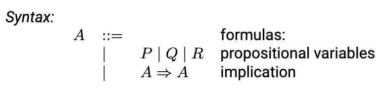
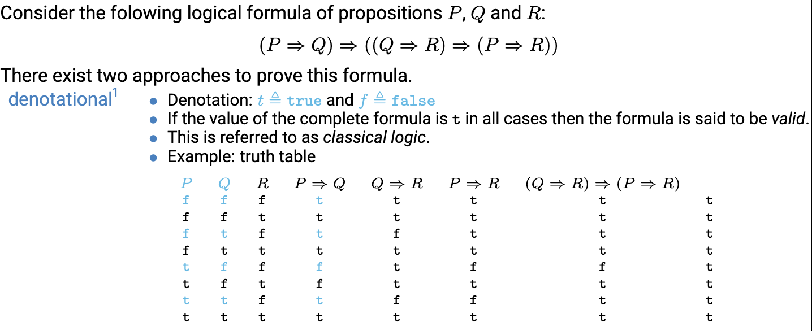
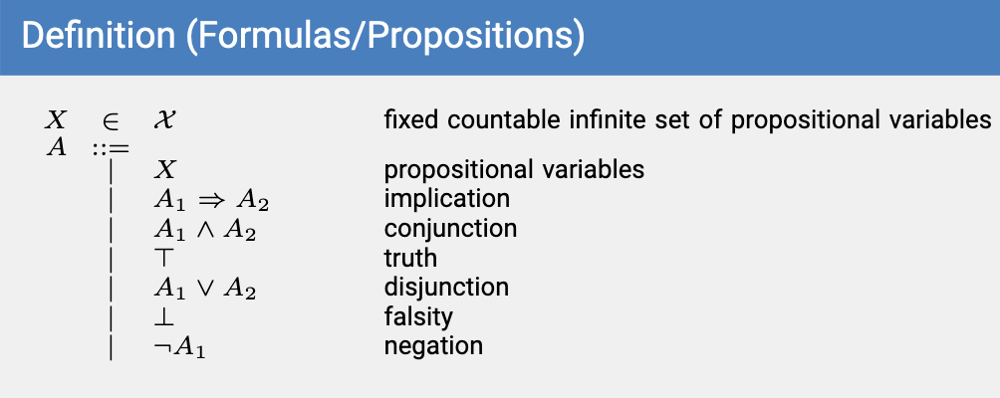
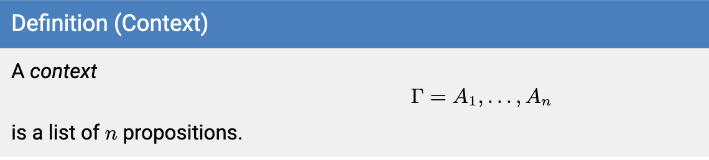
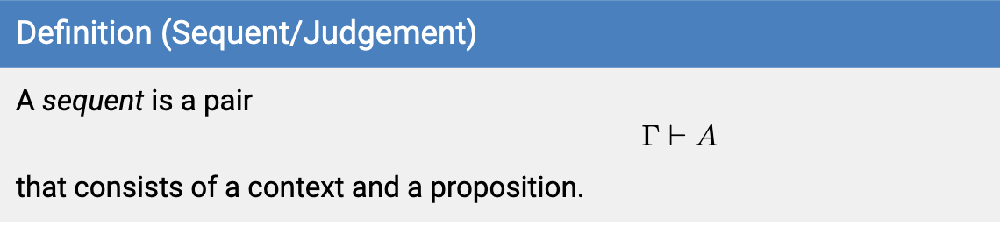
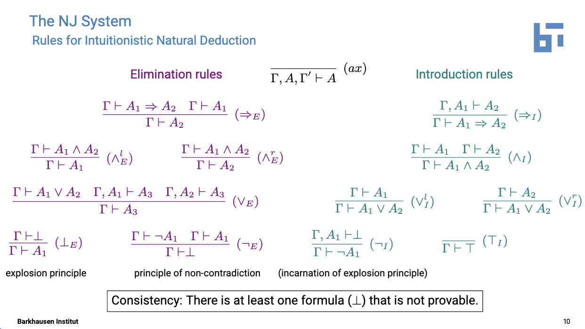
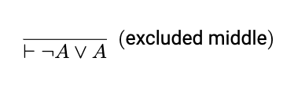
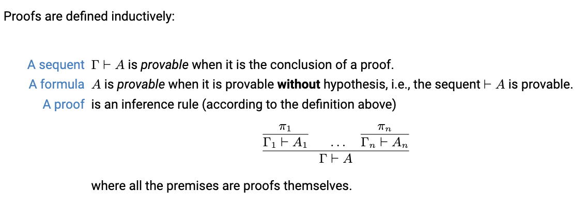
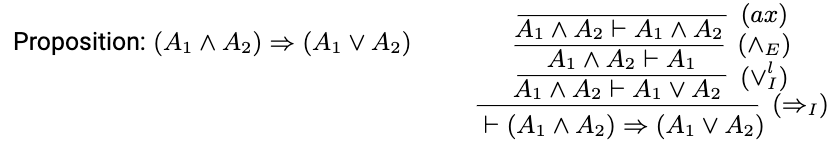
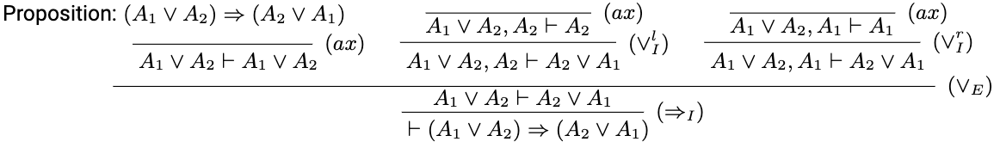

# FCPLCD

## 1. Propositional and first-order logic

Logic: understand the deep connection between logic and programming languages.
Syntax of propositional logic.

It defines a set of formulas, represented by the vaiable A, which can be formed using the propositional varaibles (P, Q, R), and the implication operator.

1. Atomic Formulas (P, Q, R): The basic building blocks of propositional logic. Simple statements that are either true or false
2. Compound Formulas: Formed by combining atomic formulas using logical connectives. The implication operator is used to express conditional statements (->). 
`P -> Q means "if P is true, then Q is also true."`

3. Propositional Formulas: These are the complete expressions in propositional logic. They can be formed by using atomic formulas and compound formulas, along with parentheses to group expressions. For example, (P -> Q) -> R is a valid propositional formula.

The syntax rules provided are a simplified representation of propositional logic. To fully understand the expressive power of this logic, you'll need to explore the concept of truth tables, which demonstrate how formulas evaluate to true or false based on the truth values of their constituent propositions.

- Truth assignments: assign truth values  to each porpositional variable.
- Valuation function: takes a truth assignment and a formula and determines the truth value of the formula based on the truth values of the variables and the logical connectives.

Consider the formula (P -> Q) -> R and a truth assignment that assigns true to P and false to Q. The valuation function would determine that this formula is true.

The semantics of propositional logic are crucial for understanding the reasoning process in logic and for constructing valid arguments.

### Natural Deduction

A formal system for constructing proofs in propositional logic.
It provides a set of rules for manipulating formulas in a structured manner to reach a desired conclusion. These rules are based on the semantics of propositional logic and allow the derivation of valid proofs.

Natural deduction provides a set of rules for manipulating formulas in a structured manner to reach a desired conclusion. These rules are based on the semantics of propositional logic and allow for the derivation of valid proofs.

### Context

Contexts in natural deduction -> List of propositions, represented by the symbol `Γ`.

A context plays a crucial role in natural deduction proofs by providing a set of assumptions that can be used to derive new formulas. By establishing a context, we can reason about the implications of these assumptions and reach valid conclusions.

### Sequents

Pair -> Context + Proposition

1. Context: The context is a list of propositions, represented by the symbol Γ. This is similar to the concept of a context introduced in the previous slide.
2. Proposition: The proposition is the conclusion that we want to prove. It is represented by the symbol A.

"from the context Γ, we can deduce the proposition A."

The "meta" implication is used to indicate the relationship between the context and the proposition, rather than representing a logical connective.

### Inference Rules

It consists of n sequents as premises, and a concluding sequent.

- Deductively: from the proofs for each of the premises, we can deduce the conlusion
- Inductively: For a proof of the conclusion, we need to construct proof of the premises

### The NJ System

Rules for intuitionistic Natural deduction. Intuitionistic natural deduction is a formal system for constructing proofs in intuitionistic logic, which is a branch of logic that emphasizes the concept of constructivism.

#### Introduction Rules
 Used to introduce new formulas intro the proof

- Axiom introduction (ax): Allows an axiom into the proof.

- Modus Ponenes (E): This rule allows us to introduce the conclusion of an implication if we have already introduced the implication and its hypothesis.

- Conjuction elimintion (ΛE): This rule allows us to introduce the conjunction of two formulas if we have already introduced both of the formulas.

#### Elimination Rules

Elimination rules are used to derive new formulas from existing ones. There are three elimination rules for intuitionistic natural deduction:

- Modus tollens (I): This rule allows us to derive the negation of the hypothesis of an implication if we have already introduced the negation of the conclusion.

- Disjunction elimination (V): This rule allows us to derive one of the disjuncts of a disjunction if we have already introduced the disjunction.

- Explosion (1B): This rule allows us to derive the negation of a contradiction if we have already introduced the contradiction.

#### Exclusion Principles

Exclusion principles are used to introduce or eliminate negation.

- Double negation elimination (1E): negation of a negation
- Principle of non-contradiction (IL): The negation of a proposition and the propostion itself cannot both be true

Consistency: A consistent theory is a theory that does not contain a contradiction.
Contradiction: Proposition and its negation are both true.

In intuitionistic logic, a proof of a proposition must provide a constructive procedure or method for constructing the object or state of affairs that the proposition describes. In other words, intuitionistic logic requires proofs to be constructive.

Law of excluded middle: For any proposition, either the proposition itself or its negation is true.

##### key differences between intuitionistic and classical logic:

- Constructivism: Intuitionistic logic is constructive, while classical logic allows for non-constructive proofs.

- Law of excluded middle: Intuitionistic logic does not accept the law of excluded middle, while classical logic does.

- Proof by contradiction: Intuitionistic logic does not allow for proof by contradiction, while classical logic does.

- Completeness: Intuitionistic logic is incomplete, while classical logic is complete.

Incompleteness means that there are some statements in intuitionistic logic that are true but cannot be proven within the system

#### Proofs

A proof is a sequence of sequents where each sequent is an inference rule.
An inference rule is a pair of sequents where the first sequent is the premise and the second sequent is the conclusion.

#### Commutativity of ∧ and ∨

the commutative property of logical conjunction and disjunction.
In logic, the commutative property states that the order in which we combine propositions using conjunction or disjunction does not matter.
For example, the following are equivalent:
P ∧ Q = Q ∧ P
P ∨ Q = Q ∨ P

