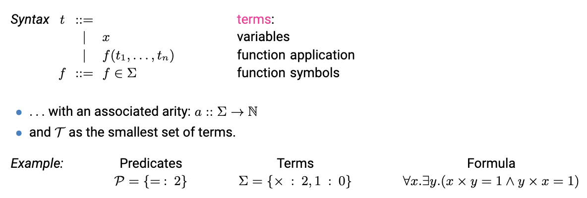

# FCPLCD

## 1. From Propositional to first'order logic

First order logic extends on propositional logic by adding predicates, and quantifiers.

The arity of a predicate is the number of arguments that it takes. For example P(x, y) has arity 2., and Q(z) has arity 1.

### Predicates
Predicates are more expressive than PL, as they capture more complec relationships between objects

Translation of last part: Let P=X where X is the set of propositional variables such that ∀X ∈ X .a(X) = 0 
all propositional variables are a predicate with arity = 0 (a(X)).

### Terms
